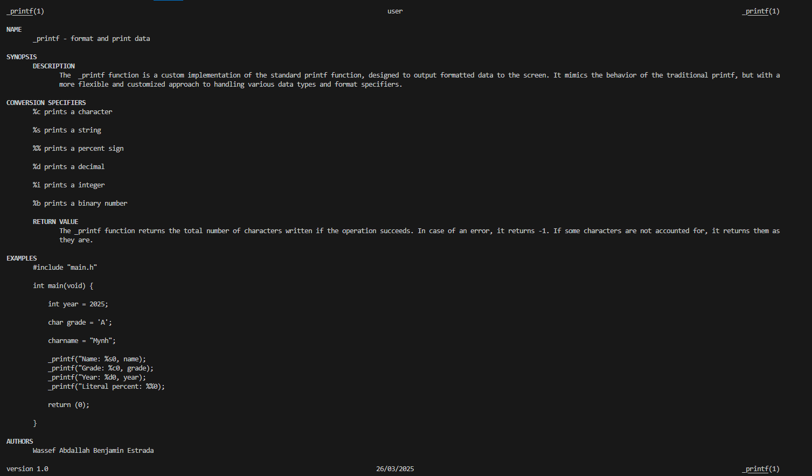

# _printf !

## Welcome to the printf project !
One of the many projects included in my curriculum at Holberton School.
This was the first major project in my journey to become a web and mobile developer.
It was completed in collaboration with another student, as part of a team of two.
The goal was to write our own version of the printf function, while following a set of technical requirements and constraints.
These will be detailed in the next section of this README.

## Technical requirements and constraints

- Allowed editors: vi, vim, emacs
- All your files will be compiled on Ubuntu 20.04 LTS using gcc, using the options -Wall -Werror -Wextra -pedantic -std=gnu89
- All your files should end with a new line
- A README.md file, at the root of the folder of the project is mandatory
- Your code should use the Betty style. It will be checked using betty-style.pl and betty-doc.pl
- You are not allowed to use global variables
- No more than 5 functions per file
- In the following examples, the main.c files are shown as examples. You can use them to test your functions, but you don’t have to push them to your repo (if you do we won’t take them into account). We will use our own main.c files at compilation; do not push your own main.c file. Our main.c files might be different from the one shown in the examples
- The prototypes of all your functions should be included in your header file called main.h
- Don’t forget to push your header file
- All your header files should be include guarded

### Github

There should be one project repository per group. If you clone/fork/whatever a project repository with the same name before the second deadline, you risk a 0% score.

### Authorized functions and macros

- write (man 2 write)
- malloc (man 3 malloc)
- free (man 3 free)
- va_start (man 3 va_start)
- va_end (man 3 va_end)
- va_copy (man 3 va_copy)
- va_arg (man 3 va_arg)

### Compilation

- Your code will be compiled this way:
```
$ gcc -Wall -Werror -Wextra -pedantic -std=gnu89 -Wno-format *.c
```

- As a consequence, be careful not to push any c file containing a main function in the root directory of your project (you could have a test folder containing all your tests files including main functions)
- Our main files will include your main header file (main.h): #include main.h
- You might want to look at the gcc flag -Wno-format when testing with your _printf and the standard printf. Example of test file that you could use:
```
#include <limits.h>
#include <stdio.h>
#include "main.h"

/**
 * main - Entry point
 *
 * Return: Always 0
 */
int main(void)
{
    int len;
    int len2;
    unsigned int ui;
    void *addr;

    len = _printf("Let's try to printf a simple sentence.\n");
    len2 = printf("Let's try to printf a simple sentence.\n");
    ui = (unsigned int)INT_MAX + 1024;
    addr = (void *)0x7ffe637541f0;
    _printf("Length:[%d, %i]\n", len, len);
    printf("Length:[%d, %i]\n", len2, len2);
    _printf("Negative:[%d]\n", -762534);
    printf("Negative:[%d]\n", -762534);
    _printf("Unsigned:[%u]\n", ui);
    printf("Unsigned:[%u]\n", ui);
    _printf("Unsigned octal:[%o]\n", ui);
    printf("Unsigned octal:[%o]\n", ui);
    _printf("Unsigned hexadecimal:[%x, %X]\n", ui, ui);
    printf("Unsigned hexadecimal:[%x, %X]\n", ui, ui);
    _printf("Character:[%c]\n", 'H');
    printf("Character:[%c]\n", 'H');
    _printf("String:[%s]\n", "I am a string !");
    printf("String:[%s]\n", "I am a string !");
    _printf("Address:[%p]\n", addr);
    printf("Address:[%p]\n", addr);
    len = _printf("Percent:[%%]\n");
    len2 = printf("Percent:[%%]\n");
    _printf("Len:[%d]\n", len);
    printf("Len:[%d]\n", len2);
    _printf("Unknown:[%r]\n");
    printf("Unknown:[%r]\n");
    return (0);
}
```
Output :
```
Let's try to printf a simple sentence.
Let's try to printf a simple sentence.
Length:[39, 39]
Length:[39, 39]
Negative:[-762534]
Negative:[-762534]
Unsigned:[2147484671]
Unsigned:[2147484671]
Unsigned octal:[20000001777]
Unsigned octal:[20000001777]
Unsigned hexadecimal:[800003ff, 800003FF]
Unsigned hexadecimal:[800003ff, 800003FF]
Character:[H]
Character:[H]
String:[I am a string !]
String:[I am a string !]
Address:[0x7ffe637541f0]
Address:[0x7ffe637541f0]
Percent:[%]
Percent:[%]
Len:[12]
Len:[12]
Unknown:[%r]
Unknown:[%r]
```
- We strongly encourage you to work all together on a set of tests
- If the task does not specify what to do with an edge case, do the same as `printf`

## Description of `_printf`

The `_printf()` function formats and prints a series of characters and values to the standard output (`stdout`).
Format specifiers, introduced by the percent symbol (`%`), indicate how each subsequent argument should be converted and displayed.

The format string is read from left to right. When a specifier is encountered, the corresponding argument is processed according to the formatting rules and then printed. This continues for each specifier in the string.
If there are more arguments than format specifiers, the extra arguments are ignored. Conversely, if there are fewer arguments than expected, the behavior is undefined.
If a format specifier is not recognized, the `%` symbol followed by the unknown character is typically printed as-is, without any special processing

## The man page

The command to call up the man page:
`man ./man_3_printf`



## The Flowchart of the _printf function


## File organisation

`printf.c`: Contains the main implementation of the `_printf` function.
It parses the format string, identifies format specifiers, and delegates the printing task to the appropriate helper functions based on the specifier.

`print_functions.c`: Contains the printing functions associated with each supported format specifier (e.g., characters, strings, integers, and percent signs).
Each function handles the output of its corresponding data type.

`utils_functions.c`: Includes utility functions used internally by the `_printf` implementation.
These functions assist with tasks such as writing characters to the output or converting integers to strings.

`main.h`: The header file for the `_printf` project.
It contains function prototypes, structure definitions (e.g., the spec_t struct), macros, and necessary standard library includes.

## How to contribute - Add a new format specifier

To add a new format specifier to `_printf` (e.g., `%x` for hexadecimal), follow these steps:

---

### 1. Add a handler function

In `print_functions.c`, create a new function to print the corresponding value:

```c
int print_hex(va_list args)
{
    unsigned int num = va_arg(args, unsigned int);
    // Call your conversion logic (e.g., convert to hex string and print)
    // For example: print_number_base(num, 16, 1);
    return count;
}
```
### 2. Declare the function prototype

In `main.h`, add:

```c
int print_hex(va_list args);
```

### 3. Add the specifier in the spec_t array

In `_printf.c` (or where your `spec_t spec[]` array lives), add:

```c
{'x', print_hex},
```

### 4. (Optional) Add utility logic
If needed, implement a helper like `convert()` to handle base conversion (binary, hex, etc.).

### 5. Write your test cases
Create a test file or extend an existing one (e.g., test_specifier.c) and test:

```c
_printf("Hex: %x\n", 255); // Expected: Hex: ff
```

### Don't forget to recompile using:

```c
gcc -Wall -Werror -Wextra -pedantic -std=gnu89 *.c -o printf_test
```

## Examples

```c
#include "main.h"

int main(void)
{
    int year = 2025;
    char grade = 'A';
    char *name = "Mynh";

    _printf("Name: %s\n", name);
    _printf("Grade: %c\n", grade);
    _printf("Year: %d\n", year);
    _printf("Literal percent: %%\n");

    return (0);
}
```
## Output:

```c
Name: Mynh
Grade: A
Year: 2025
Literal percent: %
```
## Tests

For our test phases, we tried to push the code to its limits, and we tried to make it crash using various test files.
We used a total of 6 test files, including the one provided in the project.
Of course, we started with simple tests, such as displaying a sentence, then we added numbers and various symbols to check the behaviour of the code.
Our 5 test files are as follows:
- basic tests
- intermediate tests
- advanced tests
- extremes tests
- bonus tests

<p align="center">
  
  
</p>

<p align="center">
  
  
</p>

<p align="center">
  
</p>

## Authors

[Benjamin Estrada](https://github.com/Aluranae)  
[Wassef Abdallah](https://github.com/WassefRPZ)